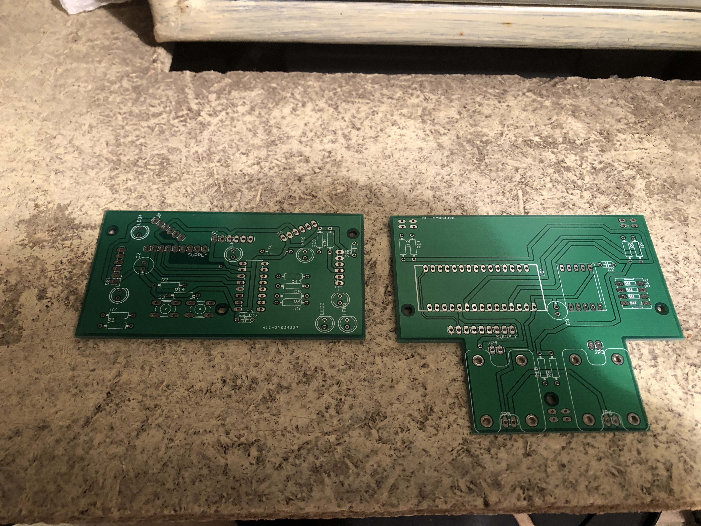
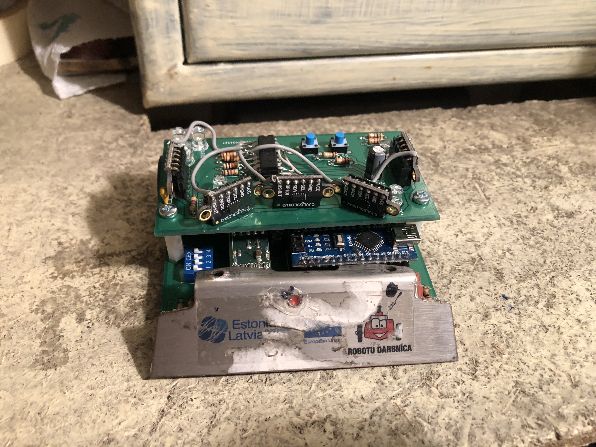
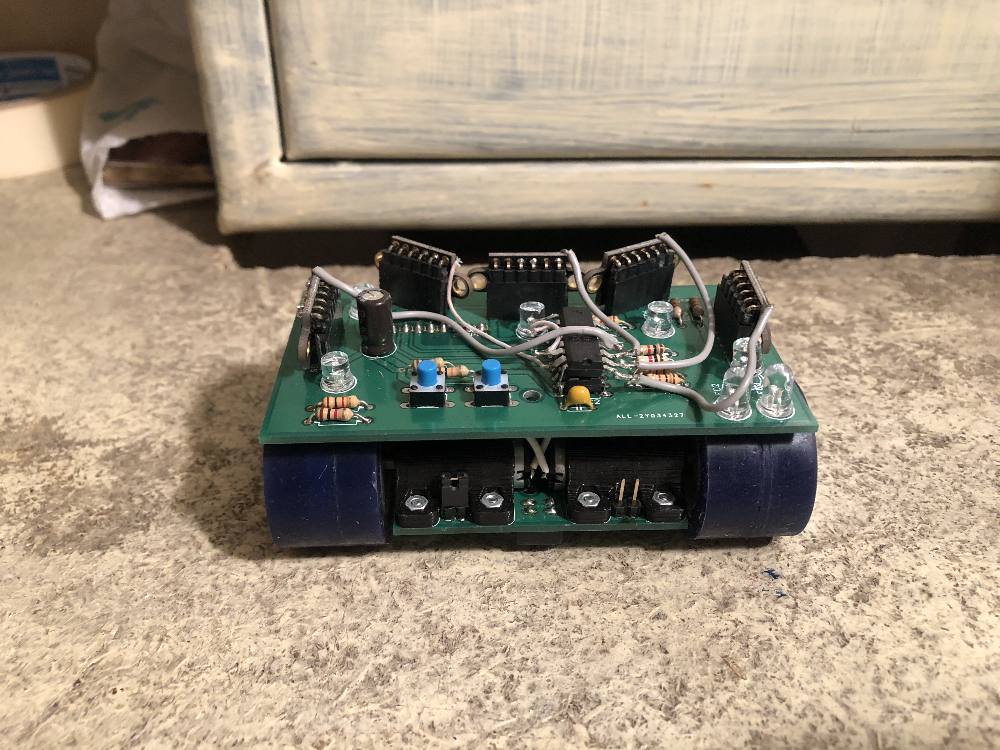
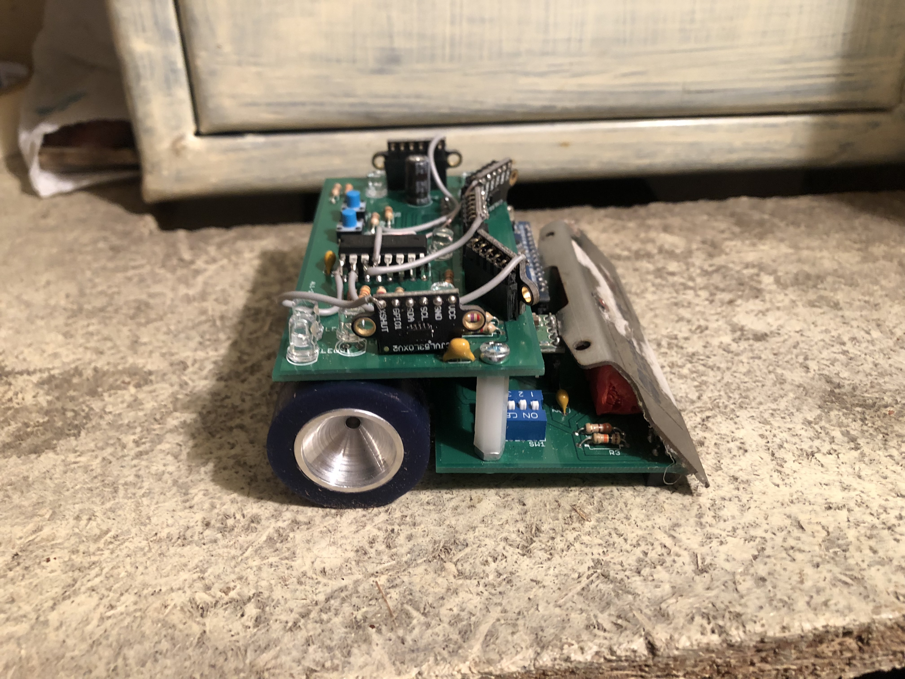

# Robotex17
Mini sumo robot created for participating in Robotex 2017 based on Arduino nano

###Some other electronic parts used:
* [1](https://hobbyking.com/en_us/brushed-motor-15mm-6v-20000kv-w-298-1-ratio-gearbox.html)
* [2](https://www.lemona.lv/?page=item&i_id=27530)
* [3](http://www.digikey.com/product-detail/en/sharp-microelectronics/GP2Y0D340K/425-1810-ND/573101)
* [4](https://www.pololu.com/product/1182)

###PCB design using Eagle software:

* [Schematics](./schematics)

###Final results:

###Source code:

* [here](./src)

